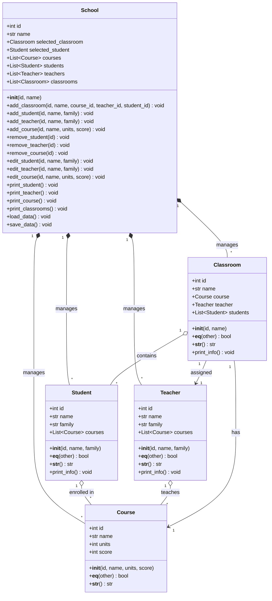

# School Management
- This project is a Python-based School Management and Academic Administration System designed to manage the main academic and administrative aspects of a school in an organized way.

- The system includes Students, Teachers, Courses, and Classrooms. Classrooms can be created with assigned teachers and students, while courses are used to manage the subjects and academic grades of each student.

- The project focuses on organizing school data, managing relationships between students, teachers, courses, and classrooms, and maintaining students’ academic records in a simple and structured system.
- - -
Here is the complete UML Class Diagram (using Mermaid Markdown) along with detailed breakdown tables and briefs for each class, its properties, and methods.

---

## 1. UML Class Diagram (Mermaid)

---

## 2. Classes Breakdown & Descriptions

### Class: `Course`
**Brief:** Represents an individual course/subject with credits and a score.

#### Properties
| Property | Type | Description |
| :--- | :--- | :--- |
| `id` | `int` | Unique identifier for the course. |
| `name` | `str` | Title/name of the course. |
| `units` | `int` | Credit units/weight of the course. |
| `score` | `int` | Grade or score obtained in the course. |

#### Methods
| Method | Parameters | Return | Description |
| :--- | :--- | :--- | :--- |
| `__init__` | `id, name, units, score` | `None` | Initializes a new course instance. |
| `__eq__` | `other` | `bool` | Checks equality based on course `id` (supports comparison with another `Course` or an integer). |
| `__str__` | *None* | `str` | Returns a tab-separated string representation of the course details. |

---

### Class: `Student`
**Brief:** Represents a student attending the school and tracks their enrolled courses.

#### Properties
| Property | Type | Description |
| :--- | :--- | :--- |
| `id` | `int` | Unique identifier for the student. |
| `name` | `str` | First name of the student. |
| `family` | `str` | Last name (surname) of the student. |
| `courses` | `list[Course]` | List of courses the student is taking. |

#### Methods
| Method | Parameters | Return | Description |
| :--- | :--- | :--- | :--- |
| `__init__` | `id, name, family` | `None` | Initializes a student instance with an empty course list. |
| `__eq__` | `other` | `bool` | Checks equality based on student `id` (matches object or integer ID). |
| `__str__` | *None* | `str` | Returns a tab-separated string: `id`, `name`, `family`. |
| `print_info`| *None* | `None` | Prints detailed profile info and list of all enrolled courses. |

---

### Class: `Teacher`
**Brief:** Represents a teacher/instructor and the courses they are assigned to teach.

#### Properties
| Property | Type | Description |
| :--- | :--- | :--- |
| `id` | `int` | Unique identifier for the teacher. |
| `name` | `str` | First name of the teacher. |
| `family` | `str` | Last name (surname) of the teacher. |
| `courses` | `list[Course]` | List of courses assigned to this teacher. |

#### Methods
| Method | Parameters | Return | Description |
| :--- | :--- | :--- | :--- |
| `__init__` | `id, name, family` | `None` | Initializes a teacher instance with an empty course list. |
| `__eq__` | `other` | `bool` | Checks equality based on teacher `id`. |
| `__str__` | *None* | `str` | Returns a tab-separated string: `id`, `name`, `family`. |
| `print_info`| *None* | `None` | Prints detailed profile info and list of taught courses. |

---

### Class: `Classroom`
**Brief:** Represents an active class session linking a course, an assigned teacher, and enrolled students.

#### Properties
| Property | Type | Description |
| :--- | :--- | :--- |
| `id` | `int` | Unique identifier for the classroom. |
| `name` | `str` | Name/label of the classroom. |
| `course` | `Course` | The course being taught in this classroom. |
| `teacher` | `Teacher` | The teacher conducting this class. |
| `students` | `list[Student]` | List of students enrolled in this classroom. |

#### Methods
| Method | Parameters | Return | Description |
| :--- | :--- | :--- | :--- |
| `__init__` | `id, name` | `None` | Initializes classroom with ID and name. |
| `__eq__` | `other` | `bool` | Checks equality based on classroom `id`. |
| `__str__` | *None* | `str` | Returns a tab-separated string: `id`, `name`. |
| `print_info`| *None* | `None` | Prints classroom information, teacher, and list of students. |

---

### Class: `School`
**Brief:** Main controller class that manages entities (students, teachers, courses, classrooms) and handles persistence (saving/loading data).

#### Properties
| Property | Type | Description |
| :--- | :--- | :--- |
| `id` | `int` | Identifier for the school. |
| `name` | `str` | Name of the school. |
| `selected_classroom` | `Classroom` | Currently active/selected classroom context. |
| `selected_student` | `Student` | Currently active/selected student context. |
| `courses` | `list[Course]` | Master list of all courses offered. |
| `students` | `list[Student]` | Master list of all registered students. |
| `teachers` | `list[Teacher]` | Master list of all employed teachers. |
| `classrooms` | `list[Classroom]` | Master list of all created classrooms. |

#### Methods
| Method | Parameters | Return | Description |
| :--- | :--- | :--- | :--- |
| `__init__` | `id, name` | `None` | Initializes school and its storage lists. |
| `add_classroom` | `id, name, course_id, teacher_id, student_id` | `None` | Validates dependencies and registers a new classroom. |
| `add_student` | `id, name, family` | `None` | Adds a new student if the ID doesn't already exist. |
| `add_teacher` | `id, name, family` | `None` | Adds a new teacher if the ID doesn't already exist. |
| `add_course` | `id, name, units, score` | `None` | Adds a new course if the ID doesn't already exist. |
| `remove_student` | `id` | `None` | Removes a student matching the given ID. |
| `remove_teacher` | `id` | `None` | Removes a teacher matching the given ID. |
| `remove_course` | `id` | `None` | Removes a course matching the given ID. |
| `edit_student` | `id, name, family` | `None` | Updates name and family for an existing student. |
| `edit_teacher` | `id, name, family` | `None` | Updates name and family for an existing teacher. |
| `edit_course` | `id, name, units, score` | `None` | Updates details of an existing course. |
| `print_student` | *None* | `None` | Prints a tabular list of all students. |
| `print_teacher` | *None* | `None` | Prints a tabular list of all teachers. |
| `print_course` | *None* | `None` | Prints a tabular list of all courses. |
| `print_classrooms`| *None* | `None` | Prints a tabular list of all classrooms. |
| `load_data` | *None* | `None` | Deserializes system data from `data.json`. |
| `save_data` | *None* | `None` | Serializes current system data into `data.json`. |